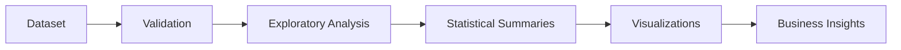
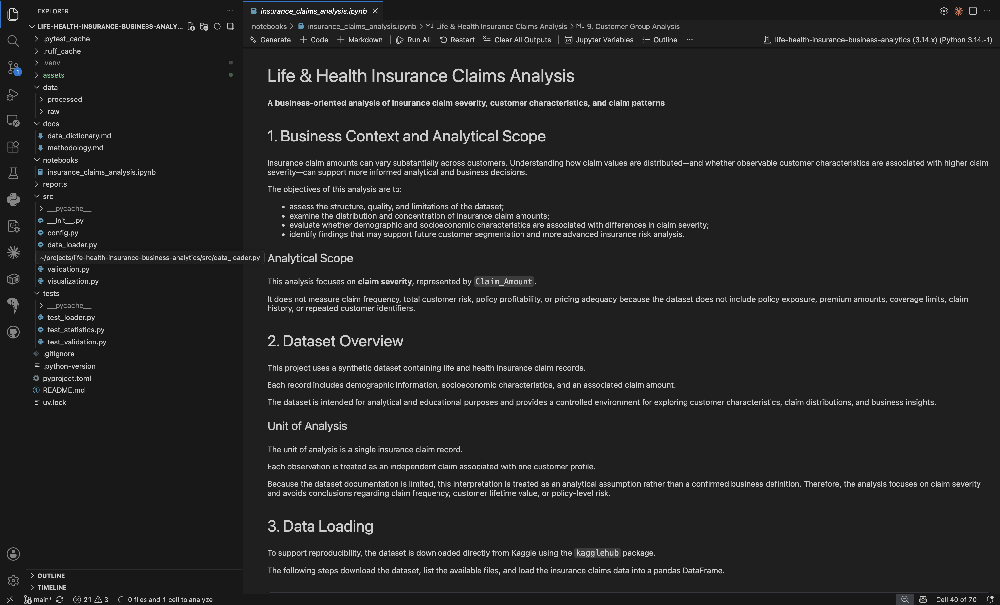
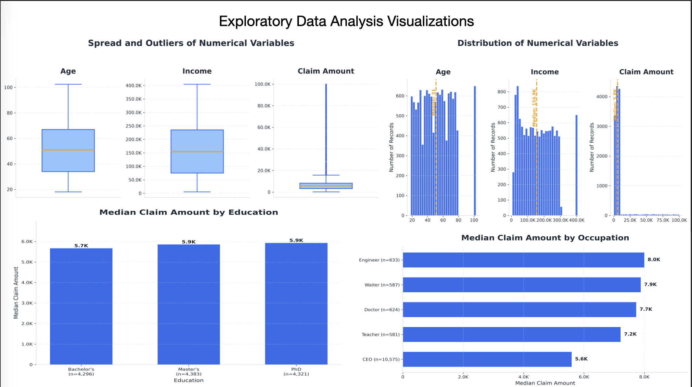
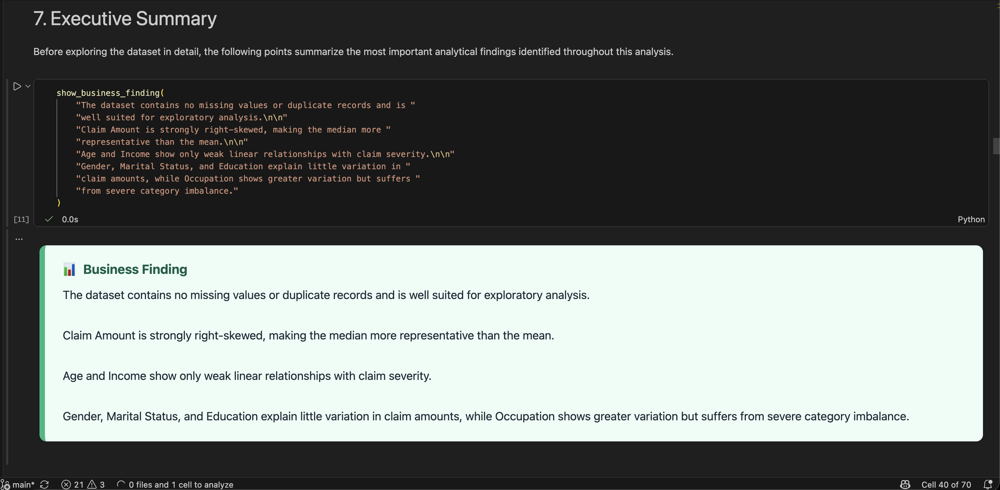

# Life & Health Insurance Business Analytics

<p align="center">
  
</p>

Business-oriented exploratory analysis of synthetic life and health insurance claims using Python, pandas, Matplotlib, reusable analytical modules, automated validation, and unit testing.


---

# Overview

This project presents an end-to-end exploratory analysis of a synthetic Life & Health Insurance dataset.

The goal is to demonstrate how raw business data can be transformed into meaningful business insights using modern Python analytics tools and clean software engineering practices.

Rather than focusing on machine learning, the project emphasizes:

- Data quality validation
- Exploratory Data Analysis (EDA)
- Statistical summaries
- Business-oriented visualizations
- Modular Python architecture
- Automated testing
- Reproducible analytical workflow

The notebook is intentionally supported by reusable Python modules instead of placing all logic inside notebook cells, making the analysis easier to maintain, test, and extend.

---

# Business Objective

The analysis investigates insurance claim behavior by exploring how claim amounts vary across customer characteristics such as:

- Age
- Gender
- Occupation
- Education
- Income
- Marital Status

The objective is to identify observable business patterns, detect potential outliers, and summarize claim distributions without building predictive models.

---

# Project Highlights

- Modular Python architecture
- Exploratory Data Analysis (EDA)
- Automated data validation
- Statistical summaries
- Business visualizations
- Jupyter Notebook workflow
- Unit testing with pytest
- Code quality verification using Ruff
- Dependency management with uv
- Professional GitHub documentation

---

# Dataset

| Metric | Value |
|---------|------:|
| Records | 13,000 |
| Variables | 7 |
| Missing Values | 0 |
| Duplicate Records | 0 |

## Variables

| Variable | Description |
|-----------|-------------|
| Age | Customer age |
| Gender | Customer gender |
| Income | Annual income |
| Marital_Status | Marital status |
| Education | Education level |
| Occupation | Occupation category |
| Claim_Amount | Insurance claim amount |

Additional dataset information is available in:

`docs/data_dictionary.md`

---

# Project Workflow


---

# Notebook Preview



The notebook serves as the presentation layer of the project while the analytical logic is implemented inside reusable Python modules.

The workflow follows a structured analytical process:

- Load the dataset
- Validate data quality
- Explore numerical and categorical variables
- Generate descriptive statistics
- Create business-oriented visualizations
- Summarize findings

---

# Visualization Gallery



The analysis includes several visualizations designed to better understand customer and claim characteristics.

### Included visualizations

- Distribution of numerical variables
- Claim amount histogram
- Boxplots for outlier detection
- Occupation vs Claim Amount
- Education vs Claim Amount
- Gender comparison
- Marital Status comparison

These visualizations provide an intuitive overview of claim behavior across multiple customer segments.

---

# Executive Summary



The project focuses on descriptive analytics rather than prediction.

Key observations include:

## Data Quality

- No missing values detected
- No duplicate records detected
- Dataset is immediately suitable for exploratory analysis

## Claim Distribution

- Claim amounts are positively skewed
- Most claims are relatively small
- A small number of high-value claims increase the overall variance

## Customer Characteristics

- Gender differences are relatively small
- Marital status shows only minor variation
- Education demonstrates modest differences
- Occupation exhibits the largest variation between customer groups

Overall, demographic variables alone explain only a limited portion of claim variability, suggesting that additional business features would likely be required for predictive modeling.
---

# Project Structure

```text
life-health-insurance-business-analytics/
│
├── data/
│   └── insurance_claims.csv
│
├── docs/
│   ├── data_dictionary.md
│   └── methodology.md
│
├── notebooks/
│   └── insurance_claims_analysis.ipynb
│
├── src/
│   ├── config.py
│   ├── data_loader.py
│   ├── statistics.py
│   ├── validation.py
│   └── visualization.py
│
├── tests/
│
├── assets/
│   ├── hero.png
│   ├── notebook-preview.png
│   ├── visualization-gallery.png
│   └── executive-summary.png
│
├── pyproject.toml
├── uv.lock
└── README.md
```

---

# Project Architecture

| Module | Responsibility |
|---------|----------------|
| `data_loader.py` | Dataset loading |
| `validation.py` | Data quality validation |
| `statistics.py` | Statistical summaries |
| `visualization.py` | Reusable plotting functions |
| `config.py` | Shared project configuration |

The notebook orchestrates the complete workflow while analytical logic remains encapsulated in reusable Python modules.

---

# Technology Stack

| Category | Technologies |
|----------|--------------|
| Programming Language | Python |
| Data Analysis | pandas |
| Visualization | Matplotlib |
| Notebook Environment | Jupyter Notebook |
| Dataset Access | KaggleHub |
| Testing | pytest |
| Code Quality | Ruff |
| Dependency Management | uv |
| Documentation | Markdown |

---

# Getting Started

## Clone the repository

```bash
git clone https://github.com/YoniAfengar/life-health-insurance-business-analytics.git
cd life-health-insurance-business-analytics
```

## Install dependencies

```bash
uv sync
```

## Launch Jupyter

```bash
uv run jupyter notebook
```

Open:

```text
notebooks/insurance_claims_analysis.ipynb
```

---

# Running Tests

```bash
uv run pytest
```

Expected output:

```text
============================= test session starts =============================
...
6 passed
```

---

# Code Quality

Run Ruff:

```bash
uv run ruff check .
```

Expected output:

```text
All checks passed!
```
---

# Documentation

Additional project documentation is available in the `docs` directory.

| Document | Description |
|----------|-------------|
| `docs/data_dictionary.md` | Dataset variables and descriptions |
| `docs/methodology.md` | Analysis methodology and workflow |

---

# Future Improvements

Potential extensions for this project include:

- Interactive dashboards with Plotly or Streamlit
- Statistical hypothesis testing
- Predictive machine learning models
- Feature engineering
- Customer segmentation
- Automated report generation
- CI/CD with GitHub Actions
- Docker support for reproducible execution

---

# Skills Demonstrated

This project demonstrates practical experience with:

- Python
- pandas
- Matplotlib
- Exploratory Data Analysis (EDA)
- Data Validation
- Statistical Analysis
- Jupyter Notebook
- Modular Project Design
- Unit Testing with pytest
- Code Quality with Ruff
- Git & GitHub
- Technical Documentation

---

# Author

**Yonatan Afengar**

Senior BI Developer with 5+ years of experience designing enterprise BI and data solutions, currently expanding into modern Data Engineering and Python development.

### Connect with me

- GitHub: [YoniAfengar](https://github.com/YoniAfengar)
- LinkedIn: [Yonatan Afengar](https://https://www.linkedin.com/in/yonatan-afengar-92bb18155/)
---

⭐ If you found this project interesting or useful, consider giving it a star.
